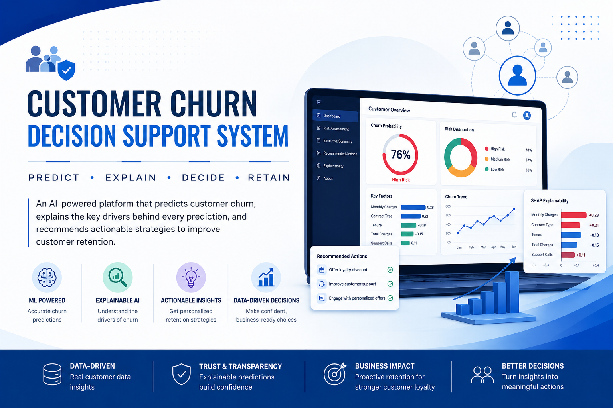
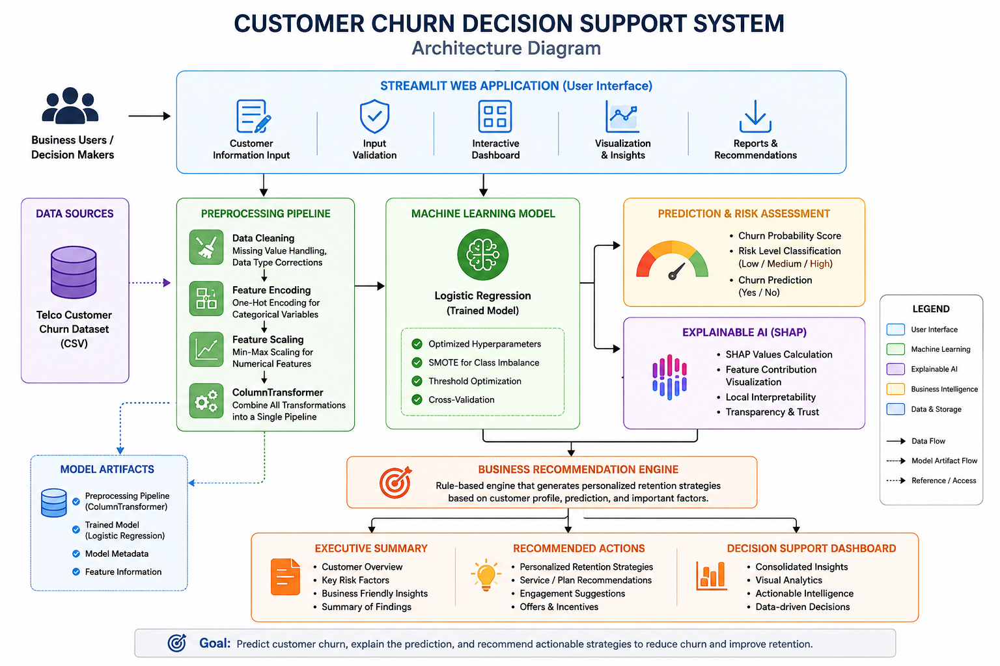
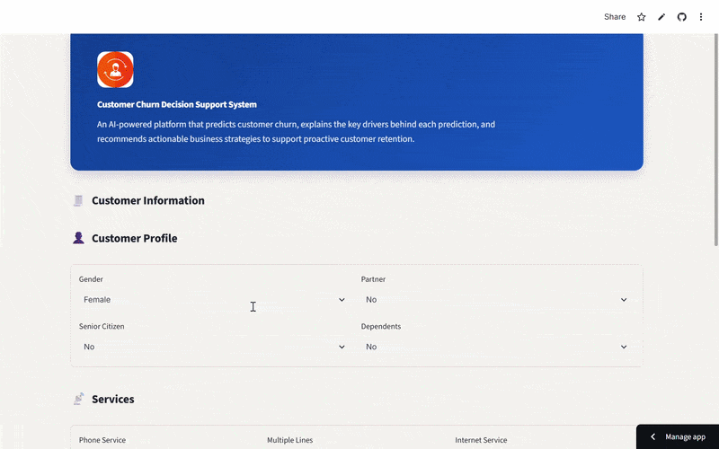
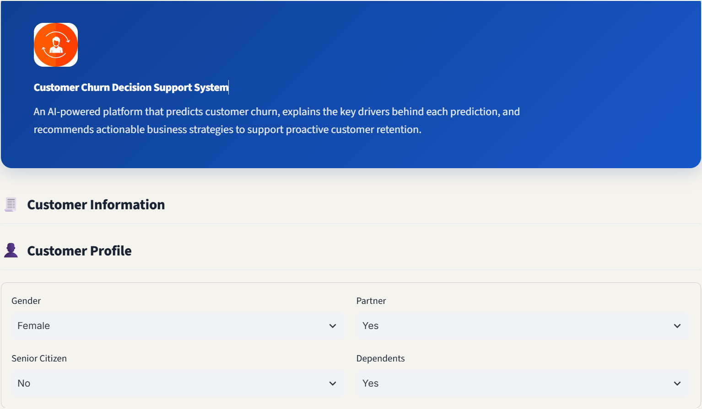
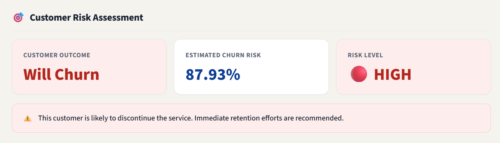
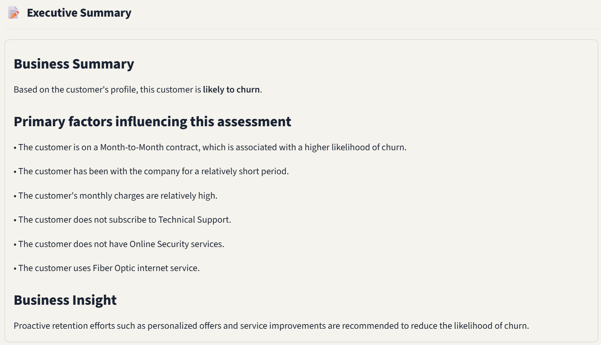
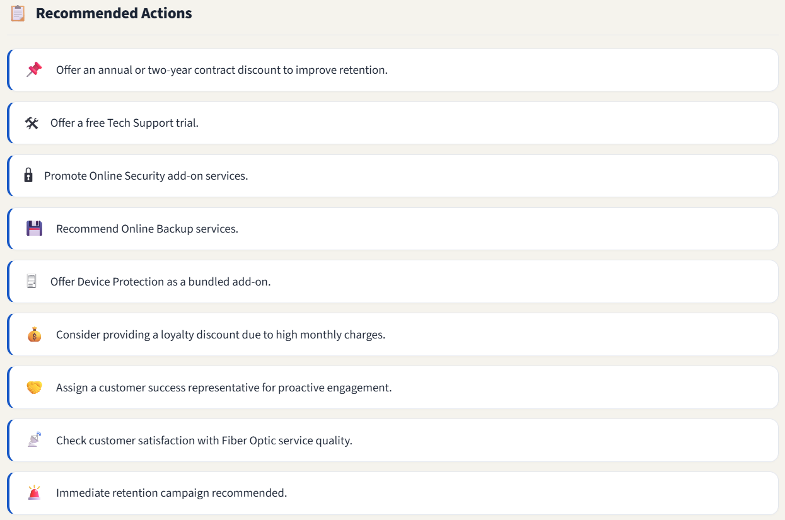
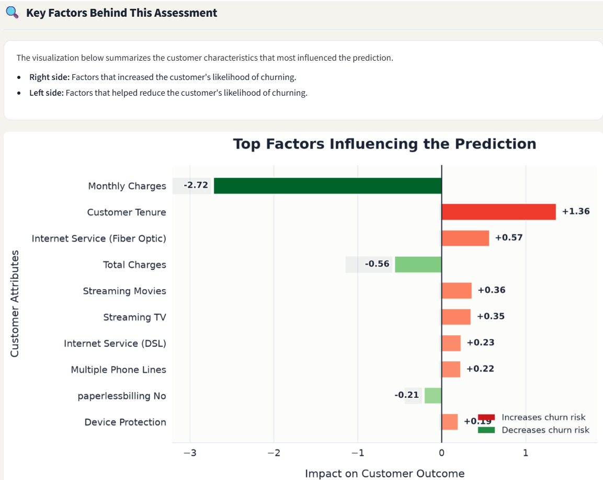

# Customer Churn Decision Support System

<p align="center">
  
</p>

<h3 align="center">
AI-Powered Customer Churn Prediction, Explainable AI, and Business Decision Support
</h3>

<p align="center">
An end-to-end Machine Learning application that predicts customer churn, explains every prediction using Explainable AI (SHAP), and recommends actionable retention strategies through an interactive enterprise dashboard.
</p>

<p align="center">

<a href="https://customer-churn-decision-support-system-aqkdrcv7xy4jctk74dxzkw.streamlit.app/">

</a>

<a href="https://github.com/charan17kk/customer-churn-decision-support-system">

</a>


</p>

---

# 🏗 System Architecture

<p align="center">

</p>

The Customer Churn Decision Support System follows an end-to-end Machine Learning workflow that transforms raw customer information into explainable business decisions.

The architecture consists of the following stages:

- **Customer Information Input** through an interactive Streamlit interface.
- **Data Validation & Preprocessing** using feature encoding, scaling, and a serialized preprocessing pipeline.
- **Machine Learning Prediction** using a trained Logistic Regression model.
- **Explainable AI (SHAP)** to interpret the contribution of each feature to the prediction.
- **Risk Assessment** to classify customers into churn risk categories.
- **Business Recommendation Engine** that generates personalized retention strategies.
- **Executive Summary & Decision Dashboard** to provide actionable insights for business stakeholders.

---

## 🎥 Live Application Preview

<p align="center">

</p>

<p align="center">
<b>Demo:</b> End-to-end prediction workflow showcasing customer profiling, churn prediction, SHAP explainability, executive summary generation, and AI-driven business recommendations.
</p>

---

## 🌐 Live Application

👉 **https://customer-churn-decision-support-system-aqkdrcv7xy4jctk74dxzkw.streamlit.app/**

---

# 📖 Overview

Customer churn is one of the most significant challenges faced by subscription-based businesses. Acquiring a new customer often costs substantially more than retaining an existing one, making early churn prediction a key business objective.

This project presents a complete **Customer Churn Decision Support System** that goes beyond traditional machine learning classification. Rather than stopping at a churn prediction, the application explains **why** the prediction was made and recommends business actions that support customer retention.

The system combines **Machine Learning**, **Explainable AI (SHAP)**, and a **Business Recommendation Engine** within an interactive Streamlit dashboard. Each prediction is accompanied by an executive-friendly explanation, personalized recommendations, and a transparent model interpretation, enabling both technical and non-technical stakeholders to make informed decisions.

Unlike many churn prediction projects that end with a probability score, this application transforms predictive analytics into practical business decision support by combining risk prediction, model explainability, and business recommendations into a single production-ready application.

---
# 🚀 Why This Project?

Most customer churn prediction projects answer only one question:

> **"Will this customer churn?"**

This application answers four:

- **Will the customer churn?**
- **Why did the model make this prediction?**
- **Which customer characteristics influenced the outcome?**
- **What business actions should be taken next?**

By combining predictive modeling with explainability and business recommendations, this project demonstrates how Machine Learning can support real-world decision making rather than simply generating predictions.

---

# 🎯 Business Problem

Telecommunication companies lose substantial revenue due to customer churn.

Traditional machine learning models often generate accurate predictions but provide limited explanation for business stakeholders, making it difficult to trust the results or determine appropriate retention strategies.

This project addresses that challenge by integrating:

- Customer churn prediction
- Explainable AI using SHAP
- Executive business summaries
- Personalized retention recommendations
- Interactive decision support dashboard

The result is an enterprise-style application designed for both Data Scientists and business decision-makers.

# ✨ Key Features

- 📊 Real-time customer churn prediction
- 🧠 Logistic Regression model with optimized prediction threshold
- 📈 Interactive enterprise-style Streamlit dashboard
- 📋 Executive Summary generated using business rules
- 💡 Explainable AI powered by SHAP
- 🎯 Customer Risk Assessment with probability score
- 📌 Personalized business retention recommendations
- 📉 Feature importance visualization
- ⚡ End-to-end preprocessing and prediction pipeline
- 🌐 Fully deployed cloud application
- 🖥 Clean, responsive, production-inspired interface

---

# 📸 Application Walkthrough

The application guides business users through the complete customer churn analysis process—from entering customer information to receiving actionable retention recommendations and transparent AI explanations.

---

## 🏠 Home Dashboard

The dashboard provides an intuitive interface for entering customer demographics, subscribed services, billing information, and account details.

<p align="center">

</p>

---

## 🎯 Customer Risk Assessment

After submitting the customer profile, the application predicts the likelihood of churn and presents:

- Predicted customer outcome
- Churn probability
- Risk level classification
- Business-oriented prediction summary

<p align="center">

</p>

---

## 📝 Executive Summary

Instead of displaying raw machine learning outputs, the system generates a business-friendly executive summary based on the customer's actual profile.

This allows managers and non-technical stakeholders to quickly understand the reasoning behind the prediction without interpreting technical model outputs.

<p align="center">

</p>

---

## 💼 Recommended Business Actions

Based on the customer's characteristics, the recommendation engine suggests actionable retention strategies that organizations can consider to reduce churn risk.

Examples include:

- Contract upgrade recommendations
- Technical Support promotion
- Online Security suggestions
- Loyalty incentives
- Customer engagement strategies

<p align="center">

</p>

---

## 🔍 Explainable AI (SHAP)

To ensure transparency, every prediction is accompanied by a SHAP explanation illustrating how individual customer attributes influenced the model's decision.

This enables technical users to validate predictions while maintaining trust in the model.

<p align="center">

</p>
---
# 🤖 Machine Learning Pipeline

The project follows a complete end-to-end Machine Learning workflow, beginning with business understanding and ending with a fully deployed decision support application.

---

## 1️⃣ Business Understanding

The primary objective was to identify customers at risk of churning so that businesses can proactively implement targeted retention strategies instead of reacting after customer loss.

The focus extended beyond prediction accuracy by ensuring that every prediction could be explained and translated into actionable business decisions.

---

## 2️⃣ Data Collection

The application uses the **Telco Customer Churn Dataset**, containing customer demographic information, subscribed services, contract details, billing information, and historical churn outcomes.

**Dataset Summary**

- 7,043 customer records
- 20 business-related features
- Binary classification problem
- Real-world telecommunications customer data

---

## 3️⃣ Data Preprocessing

The preprocessing pipeline was designed to prepare raw customer information for machine learning while maintaining consistency between training and deployment.

Key preprocessing steps include:

- Missing value handling
- Data type corrections
- One-Hot Encoding for categorical variables
- Feature Scaling using Min-Max Scaling
- ColumnTransformer pipeline construction
- End-to-end preprocessing serialization

The complete preprocessing pipeline is saved alongside the trained model to ensure identical transformations during inference.

---

## 4️⃣ Exploratory Data Analysis

Exploratory analysis was performed to better understand customer behaviour and identify variables associated with churn.

Key analyses included:

- Customer tenure distribution
- Contract type comparison
- Monthly charge analysis
- Internet service distribution
- Customer service adoption
- Churn rate by customer segment

These insights guided feature engineering and model development.

---

## 5️⃣ Feature Engineering

Feature engineering focused on improving model performance while preserving business interpretability.

Techniques included:

- Categorical feature encoding
- Numerical feature scaling
- Feature validation
- Pipeline-based preprocessing
- Business-friendly feature mapping for dashboard visualization

---

## 6️⃣ Handling Class Imbalance

Customer churn datasets often exhibit class imbalance, where customers who remain significantly outnumber those who churn.

To improve model learning and reduce prediction bias, **SMOTE (Synthetic Minority Over-sampling Technique)** was applied during training, allowing the classifier to better learn minority class patterns.

---

## 7️⃣ Model Training

Multiple supervised learning algorithms were evaluated before selecting the final production model.

Models explored included:

- Logistic Regression
- Decision Tree
- K-Nearest Neighbors
- Gaussian Naive Bayes

Following evaluation and hyperparameter tuning, **Logistic Regression** was selected for deployment due to its strong predictive performance, interpretability, and computational efficiency.

---

## 8️⃣ Model Evaluation

The model was evaluated using multiple classification metrics to ensure balanced performance across both churn and non-churn customers.

Evaluation metrics included:

- Accuracy
- Precision
- Recall
- F1 Score
- ROC-AUC

The classification threshold was further optimized to improve business-oriented decision making rather than relying solely on the default probability threshold.

---

## 9️⃣ Explainable AI

Model transparency was incorporated using **SHAP (SHapley Additive Explanations)**.

Instead of providing only prediction probabilities, the application explains how each customer attribute contributed to the final prediction.

This enables technical users to understand model behaviour while improving trust and interpretability.

---

## 🔟 Business Decision Support

One of the primary objectives of this project was to bridge the gap between machine learning predictions and real-world business decisions.

The application therefore generates:

- Executive Business Summaries
- Personalized Retention Recommendations
- Risk Categorization
- SHAP Explainability
- Decision Support Dashboard

This transforms raw model predictions into actionable business intelligence.

---

# 📊 Model Performance

The final production model was selected after evaluating multiple machine learning algorithms using business-relevant performance metrics.

| Metric | Score |
|:--------|------:|
| **Accuracy** | **78.18%** |
| **Precision** | **57.85%** |
| **Recall** | **66.04%** |
| **F1 Score** | **61.67%** |
| **ROC-AUC** | **83.27%** |

> **Note**
>
> The deployed application uses a tuned probability threshold of **0.65** instead of the default **0.50** to better align predictions with business decision-making. This prioritizes identifying customers at genuine churn risk while reducing unnecessary retention actions.
---

# 💡 Explainability Strategy

Traditional machine learning applications often provide predictions without explaining the reasoning behind them.

This project separates explanations into two complementary layers:

### 📋 Business Layer

Designed for managers and business stakeholders.

- Executive Summary
- Customer Risk Assessment
- Personalized Retention Recommendations

These explanations are generated using business-oriented rules based on the customer's actual profile.

---

### 🔬 Technical Layer

Designed for Data Scientists and Machine Learning practitioners.

- SHAP Explainability
- Feature Contribution Visualization
- Model Transparency

This separation ensures that predictions remain both technically interpretable and business friendly.

---
# 🛠 Technology Stack

| Category | Technologies |
|-----------|--------------|
| Programming Language | Python |
| Machine Learning | Scikit-learn |
| Explainable AI | SHAP |
| Data Processing | Pandas, NumPy |
| Visualization | Matplotlib |
| Deployment | Streamlit |
| Model Serialization | Joblib |

---

# 📂 Project Structure

```text
customer-churn-decision-support-system
│
├── assets/
│   ├── images/
│   │   ├── banner.png
│   │   └── demo.gif
│   │
│   ├── home_dashboard.png
│   ├── risk_assessment.png
│   ├── executive_summary.png
│   ├── recommended_actions.png
│   └── explainability.png
│
├── data/
│   └── Telco-Customer-Churn.csv
│
├── model/
│   └── customer_churn_pipeline.pkl
│
├── notebook/
│   └── customer_churn_case_study.ipynb
│
├── app.py
├── requirements.txt
└── README.md
```

---

# 🚀 Getting Started

### Clone the repository

```bash
git clone https://github.com/charan17kk/customer-churn-decision-support-system.git
```

### Navigate into the project

```bash
cd customer-churn-decision-support-system
```

### Install dependencies

```bash
pip install -r requirements.txt
```

### Launch the application

```bash
streamlit run app.py
```

---

# 🌐 Live Application

Experience the deployed application here:

### 🚀 https://customer-churn-decision-support-system-aqkdrcv7xy4jctk74dxzkw.streamlit.app/

---

# 💼 Business Impact

This application demonstrates how Machine Learning can support practical business decision-making rather than simply generating predictions.

The system enables organizations to:

- Identify customers with a high likelihood of churn
- Understand the factors influencing each prediction
- Build trust through Explainable AI
- Generate personalized customer retention strategies
- Support business stakeholders with executive-friendly insights
- Improve customer retention through proactive engagement

---

# ⚡ Challenges Faced

One of the most interesting challenges emerged **after the application was deployed**.

Initially, the Executive Summary displayed feature names directly from the SHAP output. Although technically correct, the explanations referenced one-hot encoded model features that did not always match the customer's visible selections, making them confusing for business users.

For example:

- A customer with a **Two-Year Contract** could still see references to **Month-to-Month Contract** in the explanation.
- A customer using **DSL Internet Service** could see **Fiber Optic** appear within the SHAP interpretation.

The underlying model remained correct—the issue was with how one-hot encoded features were presented to non-technical users.

### ✅ Solution

The application was redesigned with two complementary explanation layers:

### Business Layer

- Executive Summary
- Risk Assessment
- Business Recommendations

These explanations are generated using the customer's actual profile and business-oriented rules.

### Technical Layer

- SHAP Explainability
- Feature Contribution Visualization

This layer preserves full model transparency for technical users while ensuring business stakeholders receive intuitive, context-aware explanations.

This separation significantly improved usability without altering the underlying machine learning model.

---

# 🔮 Future Improvements

Potential future enhancements include:

- Customer Segmentation using Clustering
- Customer Lifetime Value (CLV) Prediction
- Automated Marketing Campaign Suggestions
- Multi-model Performance Comparison Dashboard
- Docker-based Containerization
- CI/CD Deployment Pipeline
- REST API Integration
- Cloud Deployment on AWS
- Role-Based Authentication
- LLM-powered Natural Language Business Insights

---

# 👨‍💻 Author

## Sai Charan Kandukuri

Aspiring Data Scientist passionate about building intelligent systems that combine Machine Learning, Explainable AI, and Business Decision Support.

### Connect with me

- **GitHub:** https://github.com/charan17kk
- **LinkedIn:** https://www.linkedin.com/in/sai-charan-kandukuri-16a766245/

---

# ⭐ Support

If you found this project helpful or enjoyed exploring it, consider giving the repository a **Star ⭐**.

Your support helps increase the project's visibility and motivates future open-source development.

---

<p align="center">

**Built with ❤️ using Python, Streamlit, Scikit-learn, and Explainable AI**

</p>
